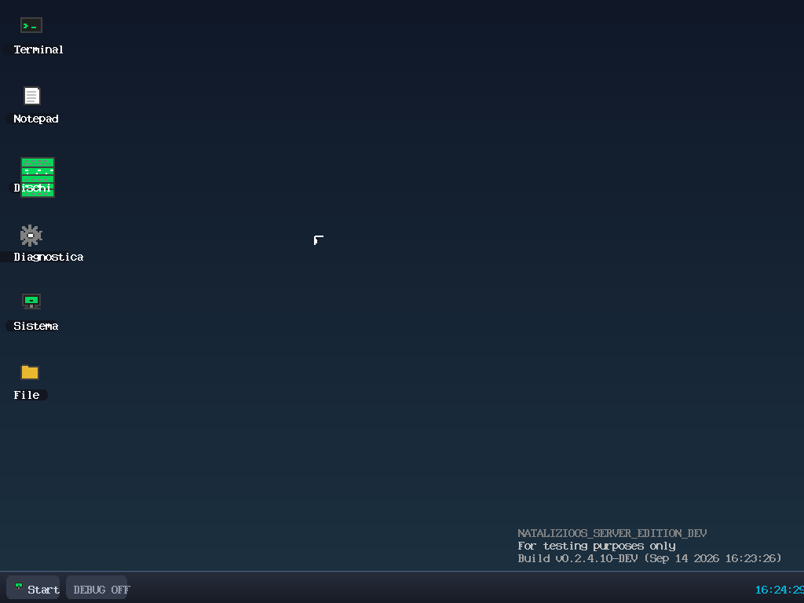
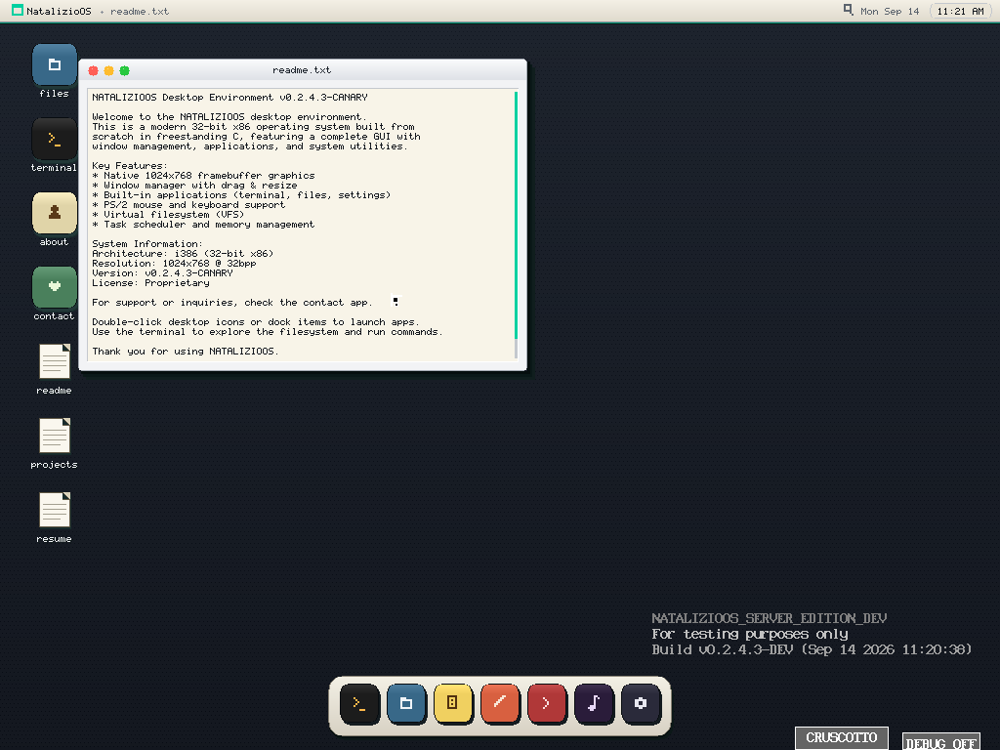
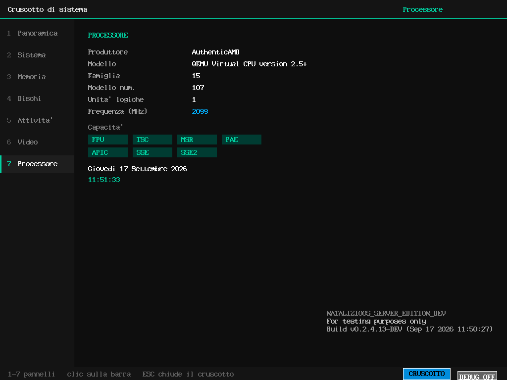
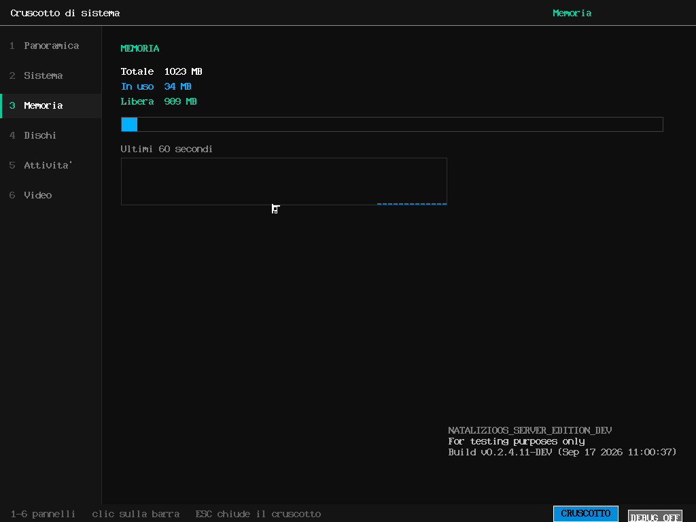

# NATALIZIOOS

[](CHANGELOG.md)
[](Makefile)
[](Makefile)
[](Makefile)
[](BUILD_STATUS.md)
[](BUILD_STATUS.md)
[](LICENSE)


## Identità visiva
> **NATALIZIOOS** è un sistema operativo sperimentale freestanding per architetture x86 a 32 bit. Il progetto implementa una catena di avvio BIOS, un kernel monolitico, driver hardware, gestione della memoria, filesystem virtuali, shell e tre ambienti desktop sviluppati a basso livello.La release descritta da questo repository è la **`v0.2.5.33`**. L’immagine principale viene generata come disco raw avviabile e può essere eseguita in ambiente **QEMU** per attività di sviluppo, verifica e studio dei sistemi operativi.

> **Stato del progetto** — NATALIZIOOS è in sviluppo. Le funzionalità, le API interne e il layout dell’immagine possono cambiare tra le release. Il progetto non è destinato a sistemi di produzione né all’installazione su hardware contenente dati importanti.

> **Proprietà** — NATALIZIOOS è un progetto proprietario. Il codice sorgente, la documentazione, gli asset grafici, gli script, le immagini e gli altri materiali del repository sono soggetti alla [Licenza Proprietaria NATALIZIOOS](LICENSE). Nessun diritto di copia, modifica, redistribuzione, sublicenza o uso commerciale è concesso al di fuori dei termini della licenza o di un’autorizzazione scritta del titolare.

## Sommario
- [Identità visiva](#identità-visiva)
- [Obiettivi](#obiettivi)
- [Metriche complete del repository](#metriche-complete-del-repository)

- [Panoramica tecnica](#panoramica-tecnica)
- [Funzionalità](#funzionalità)
- [Ambienti desktop](#ambienti-desktop)
- [Struttura del repository](#struttura-del-repository)
- [Requisiti](#requisiti)
- [Compilazione](#compilazione)
- [Esecuzione con QEMU](#esecuzione-con-qemu)
- [Percorso firmware](#percorso-firmware)
- [Specifiche tecniche e prestazioni del firmware](#specifiche-tecniche-e-prestazioni-del-firmware)
- [Verifica della build](#verifica-della-build)
- [Limitazioni note](#limitazioni-note)
- [Licenza e proprietà intellettuale](#licenza-e-proprietà-intellettuale)
- [Contributi](#contributi)

## Obiettivi

NATALIZIOOS nasce come piattaforma di ricerca e sperimentazione su tre aree principali:

1. **Sistemi operativi freestanding** — avvio senza dipendenze da un sistema ospitante, gestione diretta delle risorse e sviluppo di una toolchain minima.
2. **Grafica a basso livello** — controllo del framebuffer, rendering di primitive, gestione dell’input e costruzione di ambienti desktop senza framework del sistema ospitante.
3. **Strati software orientati agli oggetti** — runtime Objective-C locale, classi, selettori, dispatch dei messaggi e un modello ridotto di applicazione, finestra e vista eseguito nel contesto del sistema operativo.

Il progetto privilegia la leggibilità dell’architettura, la verificabilità del percorso di boot e la separazione tra componenti sperimentali.

## Metriche complete del repository

Le metriche riportate di seguito descrivono l’intero perimetro tecnico della release: sistema base, tre ambienti desktop, componenti di runtime e grafica, firmware e strumenti di sviluppo. Il conteggio è stato eseguito sulle righe dei file sorgente effettivamente presenti nell’archivio; sono esclusi immagini disco, file binari generati e directory di build.

| Area | Righe | Perimetro |
|---|---:|---|
| Sistema base | 46.344 | Boot, kernel, driver, filesystem e userspace. Include le implementazioni del Desktop 1 e del Desktop 3. |
| Desktop 1 | 3.270 | Sottosezione di `kernel/desktop.c`, già compresa nel sistema base. |
| Desktop 2 | 14.474 | Core completo in `desktop2_core/`. |
| Desktop 3 | 1.103 | Sottosezione di `kernel/desktop3.c`, già compresa nel sistema base. |
| Runtime e componenti grafici | 6.893 | Runtime Objective-C, AppKit, motore grafico, bridge, DriverKit, SoundKit e utility integrate. |
| Firmware | 31.500 | Sorgenti di `6.10_OLD/` e `6.10_NEW/`. |
| Script e strumenti | 769 | Script di build, verifica e utility di sviluppo. |
| **Totale sorgente analizzato** | **99.980** | Categorie additive, con Desktop 1 e Desktop 3 evidenziati senza duplicazione. |

Desktop 1 e Desktop 3 sono riportati anche come indicatori separati per rendere leggibile la consistenza dei due ambienti, ma non vengono sommati una seconda volta al totale del sistema base. Il totale completo corrisponde quindi a **99.980 righe di sorgente**. Per aggiornare le metriche automatiche della build è disponibile `make stato`.

## Panoramica tecnica

Il processo di avvio segue questa sequenza:

```text
Immagine BIOS raw
      │
      ├── Stage 1: bootstrap iniziale
      ├── Stage 2: caricamento del kernel
      └── Kernel NATALIZIOOS
             ├── GDT, IDT, PIC e timer
             ├── memoria fisica, paging e heap
             ├── driver video, input e storage
             ├── VFS e filesystem
             ├── shell e login
             └── ambiente grafico o testuale
```

Stage 1 viene scritto nel settore iniziale dell’immagine. Stage 2 viene collocato a partire dal settore 1. Il kernel viene scritto a partire dal settore 9 e caricato in memoria prima del passaggio alla modalità protetta.

Il limite di caricamento imposto dal bootloader è una caratteristica tecnica rilevante: ogni incremento significativo del kernel deve essere valutato anche in relazione alla capacità di caricamento disponibile.

## Funzionalità

### Kernel e servizi fondamentali

- ingresso in modalità protetta x86;
- gestione GDT, IDT, PIC e interrupt hardware;
- gestore della memoria fisica, paging e heap del kernel;
- timer e primitive di scheduling;
- gestione di utenti, sessioni e shell;
- framebuffer e modalità grafiche a risoluzione variabile;
- filesystem virtuale, RAMFS e N.A.T.FS;
- logging diagnostico tramite seriale;
- supporto a immagini persistenti e snapshot QEMU.

### Driver e accesso all’hardware

La directory `drivers/` contiene i moduli per i principali dispositivi utilizzati dal progetto:

- VGA e framebuffer;
- tastiera e mouse PS/2;
- timer;
- controller ATA;
- enumerazione PCI;
- rilevamento CPU;
- RTC;
- speaker;
- UART;
- memoria e strumenti diagnostici;
- componenti di storage e monitoraggio del sistema.

### Runtime e servizi grafici

Il sottosistema `objc/` implementa un runtime compatto con:

- registrazione e ricerca dei selettori;
- registro delle classi;
- ereditarietà e ricerca dei metodi;
- cache per il dispatch dei messaggi;
- creazione e gestione delle istanze;
- `objc_msgSend` in Assembly x86.

Il sottosistema `appkit/` espone un modello ridotto di:

- `NSView` per viste e gerarchie di contenuti;
- `NSWindow` per finestre e contenitori;
- `NSApplication` per la gestione dell’applicazione e il ciclo di rendering.

Il sottosistema `gfx/` supporta un motore vettoriale con stato grafico, traslazioni, tracciati, riempimenti e bordi, oltre a un percorso di disegno diretto sul framebuffer.

### Utility e applicazioni

La directory `ported/` contiene comandi di sistema e funzioni libc-style utilizzati dalla shell e dagli ambienti grafici. Il Desktop 1 e il Desktop 2 includono inoltre strumenti per filesystem, diagnostica hardware, memoria, processi, storage, configurazione video e produttività di base.

## Ambienti desktop

NATALIZIOOS include tre ambienti desktop indipendenti. La separazione consente di verificare tre modelli differenti di gestione dell’interfaccia senza sovrapporre i rispettivi percorsi di rendering e input.

| Ambiente | Avvio | Caratteristiche |
|---|---|---|
| **Desktop 1** | `desktop` oppure `gui` | Desktop nativo su framebuffer con finestre, barra delle applicazioni, terminale, editor, file manager, calcolatrice e strumenti diagnostici. |
| **Desktop 2** | `desktop2` oppure `gui2` | Desktop con core applicativo separato, bridge di input/framebuffer, file manager, terminale, applicazioni e giochi integrati. |
| **Desktop 3** | Selezione dal menu post-login | Ambiente di integrazione per runtime, viste, finestre, rendering, rilevamento dispositivi e componenti audio. |

### Desktop 1

Desktop 1 è l’ambiente grafico nativo più esteso del progetto. Le applicazioni sono raggruppate in aree funzionali come dischi, diagnostica, sistema e file.

Sono inclusi strumenti per:

- navigazione del VFS;
- terminale ed editor;
- informazioni su CPU, memoria, PCI, ATA e framebuffer;
- monitoraggio dei task e dell’heap;
- boot log, interrupt e porte I/O;
- integrità dell’immagine e mappa dei settori;
- risoluzione, orologio, calendario e prestazioni;
- calcolo e conversione di valori.

### Desktop 2

Desktop 2 utilizza il codice contenuto in `desktop2_core/` e comunica con il kernel attraverso `kernel/desktop2.c`. Il bridge:

1. riceve gli eventi di tastiera e mouse già decodificati dai driver;
2. li converte nel formato eventi del core del desktop;
3. esegue il frame loop del core applicativo;
4. converte il framebuffer software nel formato utilizzato dal framebuffer di NATALIZIOOS.

La documentazione tecnica del bridge e delle relative limitazioni è disponibile in [`desktop2_core/README-PORT.md`](desktop2_core/README-PORT.md).

### Desktop 3

Desktop 3 è un ambiente tecnico dedicato alla verifica dello stack grafico e orientato agli oggetti del sistema. L’implementazione principale si trova in `kernel/desktop3.c`.

Il desktop costruisce una gerarchia composta da applicazione, finestre e viste. Il rendering viene eseguito attraverso il motore grafico del progetto, con coordinate locali e stato grafico annidato.

La release attuale include:

- pannello di menu;
- finestra Workspace;
- finestra Inspector;
- finestra degli strumenti di sistema;
- viste e finestre gestite tramite il modello AppKit locale;
- rendering con riempimenti, bordi, tracciati e traslazioni;
- rilevamento di CPU, disco e memoria tramite DriverKit;
- indicatore audio basato su smoothing e conversione mu-law;
- verifiche integrate per comandi, memoria, filesystem, bridge e runtime;
- area degli strumenti scorrevole tramite i tasti freccia.

La risoluzione di riferimento è **1024×768**. Premere `Esc` per tornare al menu di selezione dell’ambiente.

Desktop 3 non è ancora un window manager completo: la sua finalità attuale è verificare l’integrazione degli strati grafici e orientato agli oggetti all’interno del kernel.

## Struttura del repository

```text
boot/             Bootstrap BIOS e caricamento del kernel
kernel/           Kernel, shell, login e ambienti desktop
drivers/          Driver hardware e servizi di piattaforma
fs/               VFS, RAMFS e N.A.T.FS
userspace/        Applicazioni e componenti user-facing
desktop2_core/    Core indipendente del Desktop 2
objc/             Runtime Objective-C locale
appkit/           NSView, NSWindow e NSApplication
gfx/              Motore grafico vettoriale e diretto
mach/             Bridge per le API Mach utilizzate dal progetto
driverkit/        Modello orientato agli oggetti dei dispositivi
soundkit/         Meter audio e logica di visualizzazione
ported/           Utility e funzioni libc-style
scripts/          Script di build e verifica
tools/            Utility di sviluppo
assets/           Asset grafici del progetto, incluso il logo vettoriale
6.10_OLD/         Percorso firmware completo
6.10_NEW/         Percorso firmware leggero
```

## Requisiti

### Toolchain

- GNU Make;
- NASM;
- Clang e LLD, oppure GCC/binutils con output ELF32 freestanding;
- Python 3;
- QEMU System x86.

Su Debian o Ubuntu:

```bash
sudo apt update
sudo apt install make nasm clang lld qemu-system-x86 python3
```

La build non utilizza la libc del sistema ospitante, gli header standard del sistema o un runtime hosted.

## Compilazione

Eseguire i comandi dalla directory principale del repository.

### Immagine grafica

```bash
make
```

Il comando predefinito genera:

```text
natalizioos-0.2.5.33.img
```

Per una ricostruzione esplicita, preceduta dalla pulizia degli output precedenti:

```bash
make graphic
```

### Immagine testuale

```bash
make text
```

Il target genera:

```text
natalizioos-text-0.2.5.33.img
```

La build testuale è mantenuta per compatibilità con i flussi precedenti. Il percorso di sviluppo principale è la build grafica.

### Target di utilità

```bash
make help         # Elenca i target disponibili
make info         # Mostra le dimensioni dei componenti dell’immagine
make dump         # Mostra il settore iniziale dell’immagine
make stato        # Rigenera BUILD_STATUS.md
make clean        # Rimuove build e immagini generate
make reset-disk   # Ricrea l’immagine grafica
```

> `make graphic` elimina gli output precedenti. Conservare una copia dell’immagine prima di eseguire il target se è necessario mantenere un artefatto già generato.

## Esecuzione con QEMU

### Avvio grafico

```bash
make run-gui
```

### Avvio senza finestra grafica

```bash
make run
```

### Avvio della build testuale

```bash
make run-text
```

### Sessione non persistente

Per impedire che le scritture di una sessione modifichino l’immagine:

```bash
qemu-system-x86_64 \
  -drive format=raw,file=natalizioos-0.2.5.33.img,snapshot=on \
  -m 64M
```

Per i test persistenti è disponibile:

```bash
make run-persist
```

Utilizzare sempre una copia dell’immagine durante le prove che modificano il filesystem.

### UART

Per esporre la seriale su TCP `127.0.0.1:4444`:

```bash
make run-gui-uart
```

I target `run-text-uart`, `run-gui-proxy` e `run-text-proxy` sono disponibili per i flussi diagnostici documentati nel Makefile.

## Percorso firmware

Le directory `6.10_OLD/` e `6.10_NEW/` contengono due percorsi separati per l’integrazione del kernel in un’immagine firmware. Non sono necessari per il normale sviluppo con QEMU.

```bash
make firmware-img
make run-firmware
make run-firmware-lite
```

Dopo `make firmware-img`, verificare l’immagine con:

```bash
./verifica_immagine.sh
```

Lo script controlla la posizione del kernel, gli offset di caricamento, la geometria dell’immagine e le impronte dei componenti principali.

## Specifiche tecniche e prestazioni del firmware

Le prestazioni del firmware sono riportate in termini di footprint, capacità di caricamento, layout su disco e configurazione di esecuzione. I valori seguenti provengono dalle build completate nella release `v0.2.5.33`; non sono stime teoriche.

### Footprint degli artefatti

| Artefatto | Firmware completo | Firmware leggero | Note |
|---|---:|---:|---|
| Stage 1 | 512 byte | 512 byte | Settore BIOS iniziale. |
| Stage 2 | 40.463 byte | 1.238 byte | Capacità configurata: 65.536 byte, pari a 128 settori. |
| Kernel NATALIZIOOS | 519.804 byte | 519.804 byte | Immagine raw caricata come `OS.BIN`. |
| Boot EFI | 4.608 byte | 4.608 byte | Artefatto EFI generato dalla build. |
| Suite diagnostica | 32.768 byte | 32.768 byte | Componente separato nell’immagine firmware. |
| Immagine disco | 10 MiB | 6 MiB | Rispettivamente 20.480 e 12.288 settori da 512 byte. |

Il kernel occupa **1.016 settori/clusters** nell’immagine FAT16. Rispetto al limite di caricamento del percorso BIOS di 1.152 settori, il footprint attuale utilizza circa **l’88,2%** della capacità disponibile. Il margine residuo è quindi di 136 settori, pari a circa 69.632 byte prima dell’espansione del formato o del loader.

### Utilizzo della capacità di Stage 2

Nel firmware completo Stage 2 utilizza circa **il 61,7%** del limite configurato (`40.463 / 65.536` byte). Il firmware leggero utilizza circa **l’1,9%** dello stesso limite (`1.238 / 65.536` byte). Questa differenza riflette la quantità di servizi inclusi nei due percorsi e non rappresenta, da sola, una misura del tempo di avvio.

### Layout e località dei dati

| Area | Firmware completo | Firmware leggero |
|---|---:|---:|
| Stage 2 NATALIZIOOS | LBA 14.000 | — |
| Kernel NATALIZIOOS | LBA 15.000 | LBA 2.000 |
| Suite diagnostica | LBA 3.000 | LBA 3.000 |
| Log di sistema | LBA 2.000 | LBA 11.000 |
| Partizione utilizzabile | LBA 34–20.445 | LBA 34–12.253 |

Il layout separa il kernel, i log, la suite diagnostica e i componenti di aggiornamento. Nel firmware completo le capsule `UPDATE.CAP` e `ROLLBACK.CAP` occupano 80 settori ciascuna; nel firmware leggero le capsule generate occupano 3 settori ciascuna, con 2.048 byte effettivamente presenti nel contenitore FAT16.

### Configurazione di riferimento

Le build firmware sono state eseguite con NASM, Python 3 e QEMU System x86. I target di esecuzione del Makefile utilizzano `qemu-system-i386`, 64 MiB di RAM, VGA standard e seriale su standard output. La build è stata completata per entrambi i percorsi; il conteggio dei byte e il layout sono verificabili nuovamente con:

```bash
make firmware-img
make -C 6.10_NEW
make -C 6.10_OLD info
make -C 6.10_NEW info
```

Il progetto non include ancora un benchmark temporale automatizzato per misurare millisecondi di boot, throughput del framebuffer o latenza dei driver. Per questo motivo, questa sezione distingue intenzionalmente le metriche di footprint e layout dai benchmark dinamici: i valori riportati descrivono risorse occupate e capacità disponibili, non una promessa di prestazioni runtime su hardware reale.


## Verifica della build

`BUILD_STATUS.md` è un documento generato da `scripts/stato_build.py`. Per aggiornarlo:

```bash
make stato
```

La procedura legge la versione dal Makefile, conta le righe dei gruppi sorgente e tenta le build grafica e testuale prima di aggiornare lo stato.

Risultati verificati per questa release:

| Controllo | Risultato |
|---|---:|
| Build grafica | Superata |
| Build testuale | Superata |
| Kernel grafico | 519.804 byte |
| Kernel testuale | 156.596 byte |
| Boot in QEMU | Raggiunta la fase di login grafico |
| Memoria QEMU utilizzata nel test | 64 MiB |
| Firma del boot sector | `55 AA` |

La verifica del boot conferma la compilazione e l’avvio iniziale. Non sostituisce la verifica interattiva di ogni desktop, driver e applicazione.

## Limitazioni note

- Il sistema non implementa ancora un isolamento completo dei processi.
- Il modello di memoria virtuale per processo non è completo.
- Il bridge Mach copre esclusivamente le API utilizzate dagli strati presenti nel progetto.
- Desktop 3 è un ambiente di integrazione grafica, non ancora un window manager completo.
- Desktop 2 copia e converte l’intero framebuffer software a ogni frame.
- La dimensione del kernel è vincolata dalla capacità di caricamento dello Stage 2.
- Alcuni componenti sono sperimentali o storici e non appartengono alla build predefinita.
- Le prestazioni e la compatibilità hardware non sono garantite al di fuori delle configurazioni testate in QEMU.

## Licenza e proprietà intellettuale

Il repository è distribuito con la **Licenza Proprietaria NATALIZIOOS**, disponibile nel file [`LICENSE`](LICENSE). Il Software è concesso in licenza e non viene venduto.

La licenza consente esclusivamente l’uso personale o interno per valutazione, studio, ricerca, sviluppo e dimostrazione, oltre alla compilazione e all’esecuzione in ambienti personali o di laboratorio. Le modifiche sono consentite solo per uso interno e non distribuito.

Sono vietati, salvo autorizzazione scritta del titolare, la pubblicazione, la redistribuzione, la sublicenza, la vendita, l’uso commerciale, l’integrazione in prodotti o servizi di terzi, la distribuzione di fork o binari derivati e l’uso dei nomi o dei loghi del progetto per suggerire approvazione o affiliazione.

I componenti di terze parti eventualmente presenti possono essere soggetti a condizioni aggiuntive. Devono essere conservate tutte le note di copyright e le attribuzioni incluse nei rispettivi file. La licenza proprietaria non concede diritti su materiali che il titolare non sia autorizzato a concedere.

Per i termini completi, le limitazioni di responsabilità e la procedura per richiedere autorizzazioni speciali, consultare [`LICENSE`](LICENSE).

## Contributi

Per contribuire al progetto:

1. compilare la modalità interessata;
2. avviare l’immagine in QEMU;
3. verificare il percorso di boot coinvolto;
4. eseguire `make stato` quando cambiano codice o dimensioni;
5. indicare toolchain, target e configurazione QEMU utilizzati;
6. preservare le attribuzioni presenti nei componenti interessati.

Le modifiche a bootloader, layout dell’immagine, memoria e framebuffer devono essere isolate e accompagnate da una verifica riproducibile.

## Immagini







