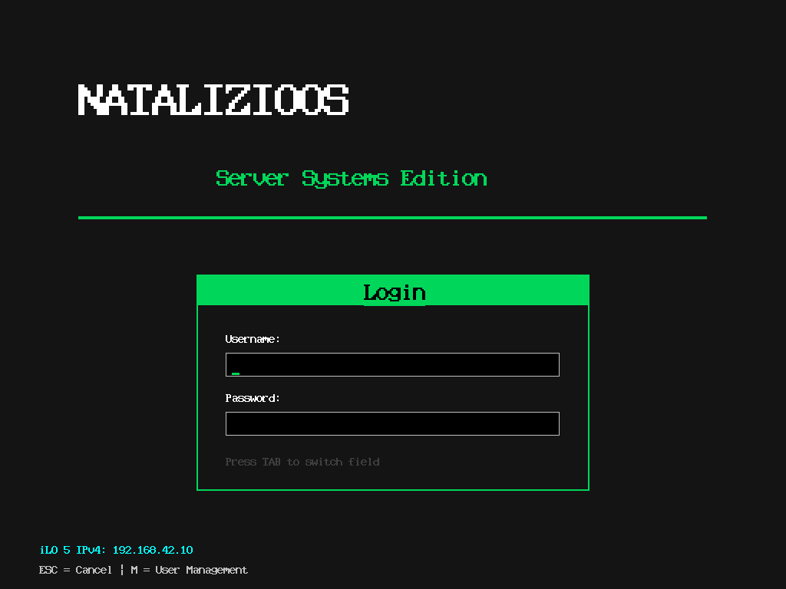

# NATALIZIOOS

Sistema operativo x86 a 32 bit scritto da zero in C e assembly NASM.

Bootloader proprio, memoria paginata, filesystem virtuale, driver
hardware e **tre ambienti desktop grafici** a 1024×768. Nessun kernel
esistente sotto: dal settore di avvio in poi è tutto scritto per
questo sistema.

---

## Avvio



Bootloader in due stadi, firmware proprio con diagnostica, e un
selettore che all'accensione lascia scegliere fra shell grafica,
shell testuale e i tre desktop.

Funziona con **32, 64, 128, 256 MB e 1 GB** di RAM: la quantità viene
letta dalla mappa E820 all'avvio, non dichiarata a priori.

---

## Desktop 1 — gestore a finestre classico


Finestre con barra del titolo e pulsanti, cartelle organizzate per
argomento, applicazioni di sistema: terminale, editor, gestione file,
strumenti di diagnostica.

---

## Desktop 2 — ambiente completo


Quasi **13.000 righe**: gestore finestre con spostamento e
ridimensionamento, dock, menu, filesystem virtuale, ricerca, e **28
applicazioni** — terminale, file manager, editor di testo, fogli di
calcolo, presentazioni, calcolatrice, impostazioni.

Lo sfondo non è una fotografia: cielo, monti, neve e foschia vengono
**calcolati a ogni disegno** da una funzione pseudo-casuale
deterministica. Un'immagine da 1024×768 occuperebbe megabyte nel
kernel; così costa qualche centinaio di byte di codice.

### Il cruscotto di sistema


Dieci pannelli che mostrano lo stato reale, letto dal sistema e non
scritto a mano: memoria, dischi, attività, processore, adattatore
video.

Il pannello Processore legge tutto via **CPUID** — produttore,
famiglia, modello, capacità — e la frequenza la **misura**, contando i
cicli in un decimo di secondo scandito dal timer.


---

## Desktop 3 — su AppKit


Il terzo ambiente è costruito su un'implementazione di **AppKit**, il
framework a oggetti di NeXT: ogni elemento visibile è una `NSView`,
ogni finestra una `NSWindow`, e il disegno passa da un motore in
stile PostScript.

L'aspetto segue NeXT: grigi, bordi in rilievo, menu staccato in alto a
sinistra invece che barra in cima allo schermo, dock verticale a
destra.

**Perché è interessante tecnicamente.** La gerarchia delle viste fa sì
che ogni vista disegni in coordinate proprie, come se fosse a zero: è
il genitore a spostare l'origine scendendo nell'albero. Questo richiede
uno stato grafico impilabile — `gsave` e `grestore` — ed è la ragione
per cui il motore di disegno esiste in quella forma.

---

## Sotto il cofano

### Nucleo

Memoria paginata fino a 1 GB, heap, scheduler con cambio di contesto,
IDT e gestione degli interrupt, filesystem virtuale, gestione utenti.

### Driver

| Driver | Cosa fa |
|---|---|
| Video | framebuffer 1024×768 a 32 bit, doppio buffer |
| Tastiera, mouse | PS/2 |
| ATA | lettura e scrittura settori |
| CPU | identificazione via CPUID, frequenza misurata |
| RTC | orologio CMOS, con gestione BCD e aggiornamenti in corso |
| Altoparlante | canale 2 del timer, segnali distinguibili |
| vGPU | adattatore video con doppio buffer e zone modificate |

### L'adattatore video

Chi disegna non parla direttamente con lo schermo: compone il
fotogramma fuori campo e lo consegna finito. Tiene traccia del
rettangolo toccato dal disegno e copia solo quello.

Nasce da un problema concreto — alcuni elementi venivano disegnati
sulla superficie già visibile, subito dopo che la copia di sfondo li
aveva cancellati, e si vedeva tremolare.

### Due motori di disegno, affiancati

**PostScript** — tracciato, stato grafico, riempimento a scansione che
gestisce le forme concave, curve di Bézier. È quello che AppKit si
aspetta.

**Diretto** — scrive subito nel framebuffer. Non sa fare curve né
rotazioni, ma dove serve un rettangolo pieno costa una frazione.

Condividono lo stesso rasterizzatore e la stessa superficie: cambiare
motore non cambia dove si disegna.

---

## Provarlo

```bash
make            # kernel grafico
make text       # kernel testuale
make run-gui    # QEMU con interfaccia
make stato      # rigenera BUILD_STATUS.md
```

`BUILD_STATUS.md` è **generato** da uno script che conta i file e
compila, invece di essere scritto a mano e invecchiare dopo tre
versioni.

---

## Come è organizzato

```
boot/           avvio in assembly, due stadi
kernel/         nucleo, desktop, shell, filesystem
drivers/        video, input, ATA, CPU, RTC, audio, vGPU
fs/             filesystem virtuale
desktop2_core/  ambiente desktop completo
objc/           runtime a oggetti
appkit/         NSView, NSWindow, NSApplication
gfx/            motori di disegno PostScript e diretto
```

---

## Scelte di sviluppo

**Compilazione severa.** `-Werror=implicit-function-declaration`: una
dichiarazione mancante ferma la build invece di passare come avviso.

Nasce da un caso concreto: il progetto si compila con gcc su una
macchina e con clang su un'altra, e clang rifiutava come errore ciò che
gcc lasciava passare. Le build arrivavano rotte senza che il primo
ambiente se ne accorgesse.

**Verifiche che distinguono.** Ogni componente viene provato con casi
che falliscono se l'implementazione è sbagliata, non solo se è assente:
un confronto deve dare esiti opposti nei due versi, una somma di
controllo deve cambiare se si scambiano due byte, un ordinamento viene
ricontrollato elemento per elemento dopo l'esecuzione.

---

## Licenze
NATALIZIOOS è software proprietario.

